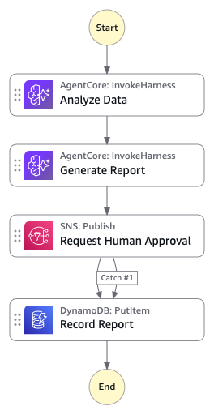

# Sales Analysis with Bedrock AgentCore and Human Approval

This workflow demonstrates how to use Amazon Bedrock AgentCore `invokeHarness` with Code Interpreter to analyze CSV data with multiple AI agents and gate report publishing behind human-in-the-loop approval. An S3 upload triggers the state machine via EventBridge, two sequential `invokeHarness` calls perform data analysis and report generation, and the workflow pauses for human approval via clickable email links before recording the final report.

Learn more about this workflow at Step Functions workflows collection: https://serverlessland.com/workflows/sales-analysis-bedrock-agentcore

Important: this application uses various AWS services and there are costs associated with these services after the Free Tier usage - please see the [AWS Pricing page](https://aws.amazon.com/pricing/) for details. You are responsible for any AWS costs incurred. No warranty is implied in this example.

## Requirements

* [Create an AWS account](https://portal.aws.amazon.com/gp/aws/developer/registration/index.html) if you do not already have one and log in. The IAM user that you use must have sufficient permissions to make necessary AWS service calls and manage AWS resources.
* [AWS CLI](https://docs.aws.amazon.com/cli/latest/userguide/install-cliv2.html) installed and configured
* [Git Installed](https://git-scm.com/book/en/v2/Getting-Started-Installing-Git)
* [AWS Serverless Application Model](https://docs.aws.amazon.com/serverless-application-model/latest/developerguide/serverless-sam-cli-install.html) (AWS SAM) installed
* Access to Amazon Bedrock foundation models (Amazon Nova Lite) in your target region
* Amazon Bedrock AgentCore available in your target region (e.g., us-east-1)

## Deployment Instructions

1. Create a new directory, navigate to that directory in a terminal and clone the GitHub repository:

   ```bash
   git clone https://github.com/aws-samples/step-functions-workflows-collection
   ```

2. Change directory to the pattern directory:

   ```bash
   cd step-functions-workflows-collection/sales-analysis-bedrock-agentcore
   ```

3. From the command line, use AWS SAM to deploy the AWS resources for the workflow as specified in the template.yaml file:

   ```bash
   sam deploy --guided
   ```

4. During the prompts:

   * Enter a stack name
   * Enter the desired AWS Region (e.g., `us-east-1`)
   * For `ApprovalEmail`, enter your email address to receive approval notifications
   * Allow SAM CLI to create IAM roles with the required permissions

   Once you have run `sam deploy --guided` mode once and saved arguments to a configuration file (samconfig.toml), you can use `sam deploy` in future to use these defaults.

5. Note the outputs from the SAM deployment process. These contain the resource names and/or ARNs which are used for testing.

6. **Confirm the SNS subscription** by clicking the confirmation link in the email you receive.

## How it works

The workflow is triggered by an S3 upload of a `.csv` file via Amazon EventBridge:

1. **Analyze Data** — The first `invokeHarness` call uses a data analyst system prompt with Code Interpreter. The agent downloads the CSV from S3, performs precise numerical analysis (revenue by region, growth rates, return rates), and returns structured JSON results.

2. **Generate Report** — The second `invokeHarness` call uses a report writer system prompt. It transforms the analysis into a concise executive report with title, summary, key findings, and recommendations.

3. **Request Human Approval** — The workflow pauses using `waitForTaskToken`. An SNS email notification is sent containing the report and clickable Approve/Reject links via API Gateway. The workflow waits up to 24 hours for a response.

4. **Record Report** — Upon approval or rejection, the report is saved to a DynamoDB table with the corresponding status and timestamp.

### Key design patterns

- **Event-driven trigger**: S3 upload → EventBridge → Step Functions (no polling)
- **Multi-agent orchestration**: Two `invokeHarness` calls with distinct role-specific system prompts
- **Code Interpreter**: Avoids LLM hallucinated math by executing real Python code for calculations
- **Human-in-the-loop**: `waitForTaskToken` with clickable links (no manual console interaction needed)
- **Zero payload bloat**: The agent downloads S3 files directly — no file content flows through SFN states

## Image



## Testing

1. After deployment, confirm the SNS email subscription.

2. **Option A: Re-upload the pre-seeded file** — The deployment seeds a `sample-sales-data.csv` in the S3 bucket. Download and re-upload it to trigger a new execution:

   ```bash
   BUCKET=$(aws cloudformation describe-stacks --stack-name <your-stack-name> --query "Stacks[0].Outputs[?OutputKey=='DataBucketName'].OutputValue" --output text)
   aws s3 cp s3://$BUCKET/sample-sales-data.csv /tmp/sample-sales-data.csv
   aws s3 cp /tmp/sample-sales-data.csv s3://$BUCKET/sample-sales-data.csv
   ```

3. **Option B: Upload your own CSV** — Upload any CSV file containing business data to the S3 bucket:

   ```bash
   aws s3 cp your-data.csv s3://$BUCKET/your-data.csv
   ```

4. **Monitor** the execution in the Step Functions console Graph view.

5. **Approve or Reject** the report by clicking the link in the email notification.

6. **Verify** the report is recorded in the DynamoDB table:

   ```bash
   TABLE=$(aws cloudformation describe-stacks --stack-name <your-stack-name> --query "Stacks[0].Outputs[?OutputKey=='ReportsTableName'].OutputValue" --output text)
   aws dynamodb scan --table-name $TABLE
   ```

## Cleanup

1. Empty the S3 bucket:

   ```bash
   aws s3 rm s3://$BUCKET --recursive
   ```

2. Delete the stack:

   ```bash
   sam delete
   ```

----
Copyright 2025 Amazon.com, Inc. or its affiliates. All Rights Reserved.

SPDX-License-Identifier: MIT-0
